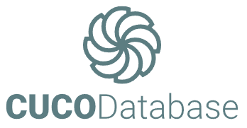

# CUCO Database

Welcome to the CUCO Database repository! This is a comprehensive collection of code and data used for cleaning and calculating the CUCO database. The database comprises recordings of patients and control individuals, with voice samples taken at three different time points: 2 weeks before surgery, 2 weeks after surgery, and 3 months after surgery. The surgeries include FESS, Tonsillectomy, Septoplasty, and a control group.

## Repository Structure

The CUCO Database is organized into the following main folders:

- **Audio Features**: Contains precalculated audio features such as formants and antiformants. For each session, there is a .csv file with the pre-computed audio features, detailed in the paper, for the sustained vowels. Moreover, for each audio file located in "Audios" there exists a .png image and a .pkl dictionary containing the frequency and bandwidth values for formant and antiformant trajectories of each speech waveform. A Kalman-based autoregressive moving average approach is employed [1-3].
  - [1]   D. D. Mehta, D. Rudoy, and P. J. Wolfe, "Kalman-based autoregressive
    moving average modeling and inference for formant and antiformant tracking,"
    The Journal of the Acoustical Society of America, vol. 132, no. 3, pp. 1732-1746, 2012.
  - [2]   D. Rudoy, D. N. Spendley, and P. J. Wolfe, "Conditionally linear
    Gaussian models for estimating vocal tract resonances," Proceedings of
    Interspeech, Antwerp, Belgium, 2007.
  - [3]   D. Rudoy, "Nonstationary time series modeling with application to speech
    signal processing," Doctor of Philosophy thesis, School of Engineering
    and Applied Sciences, Harvard University, Cambridge, MA, 2010.
    Chapter 3.
- **audios**: Raw audio data organized by type of surgery and audio said:
  - Contr
    - Vowels: Contains the audio files for each one-second utterance of the vowels.
    - Sustained vowels: Contains the audio files for each three-second sustained vowel.
    - TDU: Contains the audio files for each TDU task.
    - Speech: Contains the audio for the free speech task.
    - Raw: Contains the raw audio files for each patient.
  - Fess: equal to Contr
  - Sept: equal to Contr
  - Tonsill: equal to Contr
- **Clinical**: Contains clinical data recorded at each hospital visit (three times: 2 weeks pre-surgery, 2 weeks post-surgery, 3 months post-surgery). It also contains demographic data of each patient.
- **Metadata**: Provides metadata for each patient in the database.
  - comments on the audio files

## Installation

The CUCO Database is available on Zenodo with a Digital Object Identifier (DOI) to ensure easy access and citation. To access the database, follow these steps:

1. Visit the Zenodo page for the CUCO Database using the following link:
   [CUCO Database on Zenodo](https://zenodo.org/records/10256803)
2. You can download the dataset files and code directly from Zenodo.

For more information and specific setup instructions, refer to the dataset documentation on Zenodo.

**Note**: This repository contains the code used for cleaning and calculating the database.

## How to Cite

If you use the CUCO Database in your research or projects, we kindly request that you cite it to give credit to the contributors. Please use the following references to cite the database:

1. **Zenodo Dataset**: To cite the dataset available on Zenodo, use the provided DOI:
   1. Hernández-García, E., Guerrero-López, A., Arias-Londoño, J. D., & Godino Llorente, J. I. (2024). CUCO Database: A voice and speech corpus of patients who underwent upper airway surgery in pre- and post-operative states [Data set]. Zenodo. https://doi.org/10.5281/zenodo.10256802
2. **Scientific Data Paper**: Additionally, cite the associated paper in Scientific Data journal where the database is described in detail
   1. [Scientific Data Paper](https://www.nature.com/articles/s41597-024-03540-5#Sec9)
   2. Hernández-García, E., Guerrero-López, A., Arias-Londoño, J.D. et al. A voice and speech corpus of patients who underwent upper airway surgery in pre- and post-operative states. Sci Data 11, 746 (2024). https://doi.org/10.1038/s41597-024-03540-5

Citing both the Zenodo dataset and the journal paper helps acknowledge the work of the contributors and ensures proper recognition in the academic community.

## Usage

Learn how to use the data and code in this repository:

* For using audio features, refer to the `audio-features` folder README.
* If you need raw audio data, explore the `audios` folder README.
* Access clinical data and usage instructions in the `clinical` folder README.

## License

MIT LICENSE

## Credits

We'd like to acknowledge and express our gratitude to everyone who has contributed to this project. Your efforts and support are highly appreciated.

## Contact Information

If you have questions or need further assistance, please feel free to reach out to us:

* Email: alejandro.guerrero@upm.es, ignacio.godino@upm.es
* GitHub Issues: [Report an Issue](https://github.com/BYO-UPM/CUCO_Database/issues)

Thank you for using the CUCO Database! We hope you find it valuable for your research and projects.
